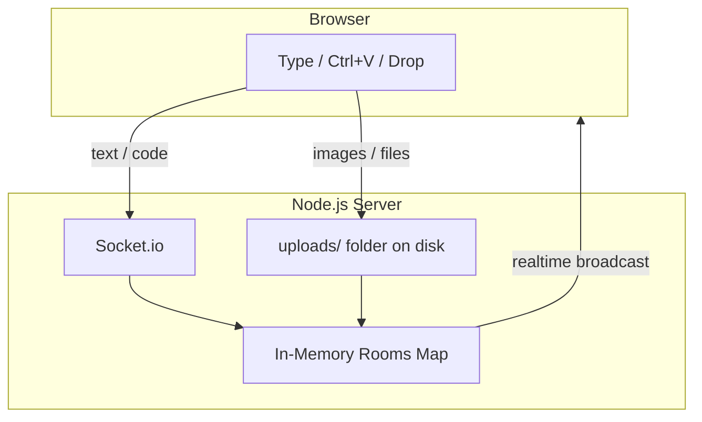

# share2d

A zero-barrier, browser-based live sharing room. Open the same short code on two devices and instantly exchange text, code, screenshots, and files — no login, no install.

## Features

- **Live shared rooms** — 4-character code, realtime sync via Socket.io
- **Type or paste** — bottom composer to write text, or Ctrl+V anywhere on the page
- **Screenshots** — Win+Shift+S snip → Ctrl+V uploads as PNG instantly
- **Drag & drop** — files, images, PDFs onto the page
- **Delete items** — remove individual text, images, or files (syncs to all devices)
- **Clear room** — wipe everything with one click
- **QR code join** — scan from phone to join the same room
- **Presence indicator** — see how many devices are connected
- **Mobile-friendly** — composer works on phones, responsive layout
- **Dark/light mode** — follows system preference automatically

## How it works (user flow)

1. Click **Create Room** — you get a 4-character code (e.g. `K4XQ`)
2. Open the same code on another device (type it, scan the QR, or share the link)
3. Type in the composer, or **Ctrl+V** to paste text, code, or screenshots
4. Drag and drop files, or use the attach button
5. Everything appears instantly on every connected device

---

## Storage — how data is stored

share2d uses a **two-tier temporary storage model**. There is no database. Everything is designed for short-lived handoffs, not permanent storage.



### Tier 1 — In-memory (RAM)

All room state lives in a JavaScript `Map` on the server process:

```
rooms = Map {
  "K4XQ" → {
    items: [ { id, type, content/url, timestamp, ... } ],
    lastActive: timestamp,
    sockets: Set of connected socket IDs
  }
}
```

| Data type | Where stored | How it moves |
|---|---|---|
| Text | RAM only | Sent directly over Socket.io — never written to disk |
| Code | RAM only | Same as text, auto-detected by syntax patterns |
| Image metadata | RAM | File binary goes to disk; metadata (url, filename, size) in RAM |
| File metadata | RAM | Same as images |

**Lifecycle:**
- Created when someone creates or joins a room
- Updated on every paste, type, upload, or delete
- Auto-deleted after **24 hours** of inactivity (`ROOM_TTL`)
- **Gone immediately** on server restart or redeploy

### Tier 2 — Local disk (`uploads/`)

Only **binary files** (images, PDFs, code files, etc.) touch disk:

```
share2d/
└── uploads/
    ├── a1b2c3d4-....png      ← screenshot pasted via Ctrl+V
    ├── e5f6g7h8-....pdf      ← dragged PDF
    └── ...
```

- Saved by **Multer** with a UUID filename (original name kept in metadata)
- Served back via `GET /files/:filename`
- Deleted when: user deletes the item, room is cleared, room expires, or item count exceeds 200 (oldest trimmed)
- Default path: `share2d/uploads/` (configurable via `UPLOADS_DIR` env var)
- **Not committed to git** (listed in `.gitignore`)

### What is NOT stored anywhere

- User accounts or identities
- IP addresses or device info
- Clipboard history beyond what's actively in the room
- Anything after room expiry or server restart

---

## Storage — what happens when you deploy

On **Render** (or any cloud PaaS), both storage tiers are **ephemeral**:

| Event | In-memory rooms | Uploaded files |
|---|---|---|
| Server running normally | Persists while active | Persists on disk |
| 24h room idle | Room + files deleted | Files deleted |
| User deletes item | Removed from room | File deleted from disk |
| Server restart / redeploy | **All rooms lost** | **All files lost** |
| Render free tier spin-down | Same as restart | Same as restart |

This is **by design for v1** — share2d is a temporary clipboard, not a file hosting service. Users should treat it like passing a note, not saving to Google Drive.

### What still works after redeploy

- The app itself (frontend + API + websockets)
- Creating new rooms
- Sharing between devices in real time

### What breaks after redeploy

- All existing rooms and their contents
- All uploaded files (images, PDFs, etc.)
- Anyone mid-session gets disconnected and sees an empty room if they rejoin

---

## Storage — what to do next (roadmap)

For v1 (current), ephemeral storage is the right choice — zero cost, zero setup, matches the "temporary handoff" use case.

If you need persistence later, upgrade in this order:

| Phase | Solution | Cost | Effort | Best for |
|---|---|---|---|---|
| **v1 (now)** | RAM + local disk | Free | Done | Temporary sharing, learning |
| **v2** | Redis for rooms + cloud disk for files | ~Free tier | Medium | Survive restarts, multi-instance |
| **v3** | PostgreSQL for metadata + S3/R2 for files | Low | Higher | Permanent rooms, user accounts |

**Recommended v2 architecture:**

```
Browser → Socket.io → Node.js
                         ├── Redis (room state + text items)
                         └── Cloudflare R2 / AWS S3 (file blobs)
```

This would let rooms survive server restarts while keeping files in cheap object storage. Not needed until you outgrow the temporary-handoff model.

---

## Architecture

```
Browser (React + Vite)
    │
    ├── REST API (/api/rooms, /api/rooms/:code/files, /files/:name)
    │
    └── Socket.io (/socket.io) — text, delete, clear, presence, realtime sync
            │
            ▼
    Node.js + Express
    ├── In-memory Map (rooms, text, metadata)
    └── uploads/ folder (images, files)
```

### Limits (configurable via env vars)

| Limit | Default | Purpose |
|---|---|---|
| Max file size | 50 MB | Prevent disk exhaustion |
| Max text length | 100,000 chars (~100 KB) | Prevent memory abuse |
| Max items per room | 200 | Auto-trim oldest when exceeded |
| Room TTL | 24 hours | Auto-cleanup idle rooms |

---

## Project structure

```
share2d/
├── package.json          # Root workspace — npm run dev / build / start
├── render.yaml           # Render.com deploy config
├── .env.example          # Environment variable reference
├── server/
│   ├── index.js          # Express + Socket.io + file uploads + cleanup
│   └── package.json
├── client/
│   ├── src/
│   │   ├── components/
│   │   │   ├── Landing.jsx/css    # Create or join a room
│   │   │   ├── Room.jsx/css       # Live room (paste, drag-drop, QR, delete)
│   │   │   ├── Composer.jsx/css   # Bottom text input bar
│   │   │   └── ShareItem.jsx/css  # Text, code, image, file cards
│   │   ├── App.jsx
│   │   └── main.jsx
│   ├── vite.config.js
│   └── package.json
└── uploads/              # Runtime only — gitignored, created on first upload
```

---

## Local development

```bash
npm install
npm run dev
```

| Service | URL |
|---|---|
| Frontend (Vite dev server) | http://localhost:5173 |
| Backend (Express + Socket.io) | http://localhost:3001 |
| Health check | http://localhost:3001/health |

Vite proxies `/api`, `/files`, and `/socket.io` to the backend automatically.

### Test on two devices (same Wi-Fi)

1. Run `npm run dev`
2. Find your PC's IP: `ipconfig` → IPv4 Address (e.g. `192.168.1.42`)
3. On your phone, open `http://192.168.1.42:5173`
4. Create a room on PC, join the same code on phone

---

## Production

```bash
npm run build    # Builds client to client/dist/
npm start        # Serves everything on one port (default 3001)
```

Or:

```bash
npm run start:prod   # build + start in one command
```

In production, a single Node.js process serves:
- The React frontend (static files from `client/dist/`)
- REST API (`/api/*`)
- File downloads (`/files/*`)
- WebSocket connections (`/socket.io`)

Set `NODE_ENV=production` when deploying.

---

## Deploy to Render (recommended)

The easiest way for **two devices on any network** (phone on mobile data + laptop, etc.).

1. Push this repo to GitHub
2. Go to [render.com](https://render.com) → New → **Web Service**
3. Connect your repo — Render reads `render.yaml` automatically
4. Or set manually:
   - **Build command:** `npm install && npm run build`
   - **Start command:** `npm start`
   - **Health check path:** `/health`
5. Deploy — you get a URL like `https://share2d-xxxx.onrender.com`
6. Open that URL on both devices, create/join the same room

### Other platforms

| Platform | Build | Start | Notes |
|---|---|---|---|
| Render | `npm install && npm run build` | `npm start` | Free tier, ~30s cold start |
| Railway | same | same | Requires credit card |
| Fly.io | same | same | Good for always-on |
| VPS | same | `NODE_ENV=production npm start` | Use PM2 or systemd |

---

## Environment variables

Copy `.env.example` to `.env` for local overrides:

| Variable | Default | Description |
|---|---|---|
| `PORT` | 3001 | Server port (Render sets this automatically) |
| `HOST` | 0.0.0.0 | Bind address |
| `NODE_ENV` | development | Set to `production` when deployed |
| `UPLOADS_DIR` | `./uploads` | Where uploaded files are saved |
| `MAX_FILE_SIZE` | 52428800 | Max upload size in bytes (50 MB) |
| `MAX_TEXT_LENGTH` | 100000 | Max characters per text/code item |
| `MAX_ITEMS_PER_ROOM` | 200 | Max items before oldest are auto-removed |
| `ROOM_TTL` | 86400000 | Room expiry in ms (24 hours) |

---

## Security

- Room codes (4 chars) are the only access control — treat as unlisted, not secret
- No user accounts, no passwords, no tracking
- Server paths (`filePath`) are never sent to clients
- File downloads protected against path traversal
- Security headers: `X-Content-Type-Options`, `X-Frame-Options`, `Referrer-Policy`
- Do not share passwords, financial data, or anything sensitive

---

## Production checklist

| Check | Status |
|---|---|
| Single port serves frontend + API + websockets | Yes |
| Binds to `0.0.0.0` (cloud-ready) | Yes |
| Health endpoint at `/health` | Yes |
| Socket.io reconnect + auto rejoin room | Yes |
| Path traversal protection on file downloads | Yes |
| File size / text length / item count limits | Yes |
| Internal server paths stripped from responses | Yes |
| Graceful SIGTERM shutdown | Yes |
| Security headers | Yes |
| Upload directory gitignored | Yes |

---

## Known limitations (v1)

| Limitation | Impact | Workaround |
|---|---|---|
| Ephemeral storage | Data lost on redeploy/restart | Use for temporary handoffs only |
| In-memory rooms | No persistence across restarts | Redis in v2 if needed |
| No encryption | Room code = only lock | Don't share sensitive data |
| 4-char codes (~1.1M combos) | Theoretically guessable | Rooms expire in 24h; fine for temp use |
| Render free cold start | ~30s delay after idle | Upgrade to paid tier or use Fly.io |
| Single server instance | No horizontal scaling yet | Redis + S3 in v2 |

---

## Tech stack

| Layer | Technology |
|---|---|
| Frontend | React 19, Vite, React Router, Socket.io-client, qrcode |
| Backend | Node.js 18+, Express, Socket.io, Multer |
| Realtime | Socket.io (websocket + polling fallback) |
| Storage | In-memory Map + local filesystem (no database) |
| Deploy | Render (render.yaml), any Node.js host |
